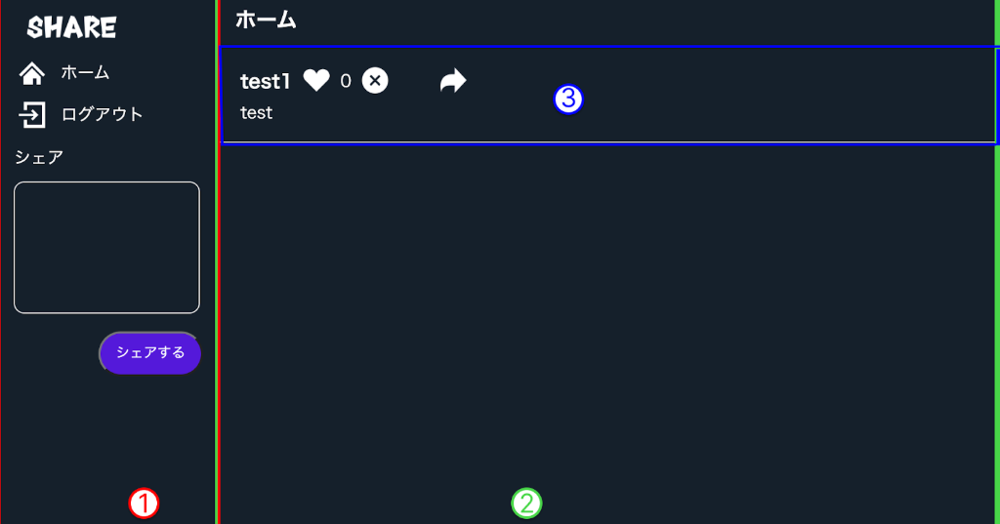
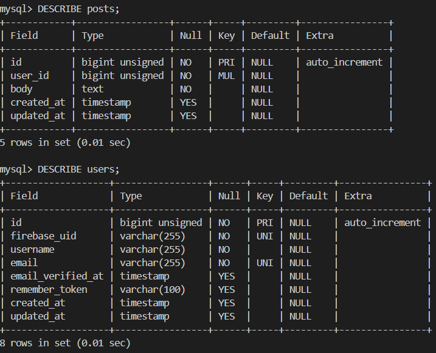
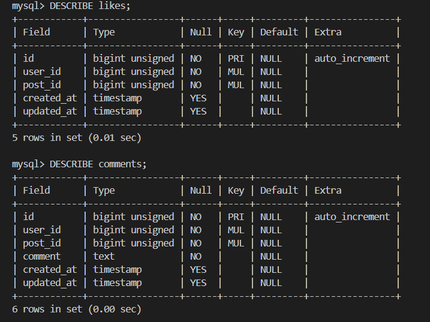

# Twitter-app   
## 画像  （メインページ）  

  
## 作成した目的  

## アプリケーションURL  
 新規登録  http://localgost:3000/register  
 ログイン  http://localhost:3000/login  

## 他のリポジトリ  
  バックエンド laravel-backend  
  フロントエンド nuxt-frontend  
## 機能一覧  
- 新規登録機能  
- ログイン機能  
- 投稿機能  
- いいね機能  
- コメント機能  

## 使用技術（実行環境）  
　laravel 8.x  
  nuxt v2.18.1  
  php  v8.1.2  
    
## テーブル設計  
  
  

  
## ER図  
![ER図] (./laravel-backend/erd3.png) 

## 環境構築  (クローン編)　　

1. クローンしたいところに移動  
2. git clone git@github.com:yuriko52-star/提出フォルダー名.git  
3. mv 提出フォルダー名 任意のフォルダー名  
4. 任意のフォルダー名の リポジトリ作成  
5. cd  任意のフォルダー名  
6. git remote set-url origin git@github.com:yuriko52-star/任意のフォルダー名.git  
7. git remote -v  
8. git add .  
9. git commit -m "コメント"  
10. git push origin main  

### laravel側  
11. cd laravel-backend  
12. composer install  
    データベースの作成  
    mysql -u root -p  
    CREATE DATABASE  twitter_app_clone  
     
13. .cp .env.example .env  
14. .envに環境変数を追加  
    DB_DATABASE=twitter_app_clone  
    DB_USERNAME=root  
    DB_PASSWORD=root  
15. php artisan key:generate  
16. php artisan migrate
17. touch firebase-adminsdk.json   
18. cd firebase-adminsdk.json  
19. ファイルの中身をコピーする  
20. php artisan serve  

### nuxt側  
21. cd nuxt-frontend  
22. cd plugins  
23. touch firebase.js  
24. cd touch firebase.js  
25. ファイルの中身をコピーする  
26. yarn dev  

